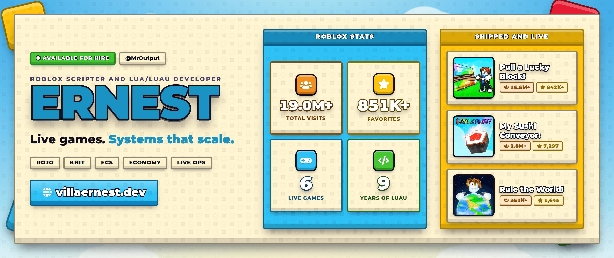

  

   
   

  

    
    
    
    
    
    
  

Roblox Scripter and Lua/Luau Developer, also known as MrOutput. Lead Developer on live Incremental and RNG titles, nine years of Luau, and the systems that keep a running game upright.

**Open to small commissions.** [villaernest.dev](https://villaernest.dev), [ernest@villaernest.dev](mailto:ernest@villaernest.dev), [@MrOutput](https://www.roblox.com/users/367354517/profile)

## Live games

Six shipped titles, 19.0M visits between them.

| Game | Visits | Favorites |
| :--- | ---: | ---: |
| [Pull a Lucky Block!](https://www.roblox.com/games/72445826681792) | 16.6M | 842K |
| [My Sushi Conveyor!](https://www.roblox.com/games/113274475497808) | 1.8M | 7.3K |
| [Rule the World!](https://www.roblox.com/games/119274132884020) | 351K | 1.6K |
| [My Ant Colony](https://www.roblox.com/games/128551550921649) | 98K | 204 |
| [Fish for Enchants!](https://www.roblox.com/games/85819924646961) | 40K | 411 |
| [Cut Grass for Bugs!](https://www.roblox.com/games/131936957932695) | 11K | 39 |

Figures from the Roblox API, July 2026. The banner above is generated from the same source.

## What I build

- Economy and progression systems, from currency sinks to prestige loops
- Weighted RNG and luck curves, modelled before a line is written
- Live ops on running games: staged releases, telemetry, balance passes
- Tooling that unblocks a team, such as a Perlin noise previewer for terrain
- Rojo-first codebases, including migrating Studio-only projects onto it
- Staging to production CI/CD, so no change reaches players unvalidated

## Stack

**Languages** Luau, Lua, TypeScript, JavaScript, Python  
**Roblox** Rojo, Knit, ECS, Matter, React-Lua, Roblox Studio  
**Web** Next.js, React, Node.js, Sanity

## Elsewhere

Portfolio and services: [villaernest.dev](https://villaernest.dev)  
Discord: [villaernest](https://discord.com/users/1262794859425828867)
